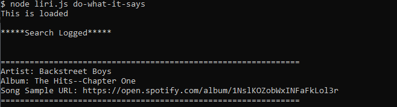

# liri-node-app

## LIRI Bot, language interpretation and recognition interface

### LIRI is a simple program which allows you to do three searches
### Including one method which accesses one of the other three

1. The first argument consists of one of four options
    1. concert-this
        * takes whatever follows in the command line, a band,
        * to search for future concert information.
    2. spotify-this-song
        * takes whatever follows in the command line, a song,
        * to search for more details involving the track.
    3. movie-this
        * takes whatever follows in the command line, a movie,
        * to search and return more details about the film.
    4. do-what-it-says
        * this command will read a text file and perform whichever
        * of the former methods are written inside of it

## Examples

<code> node liri.js concert-this weird al </code>
<code> node liri.js spotify-this-song all the small things </code>
<code> node liri.js movie-this the matrix </code>
<code> node liri.js do-what-it-says</code>

## Appearance in Bash

[Link to a video of the application in action](https://drive.google.com/file/d/1M6mki2asqyNibyxhHImZ-o9Ld5NXObIy/view)

[Link to GitHub repository](https://github.com/harblesin/liri-node-app)